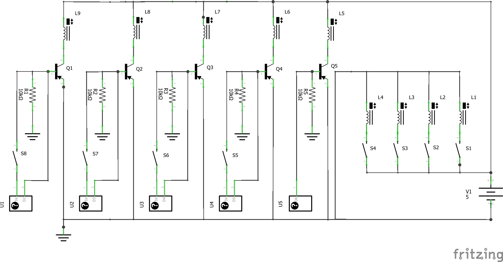
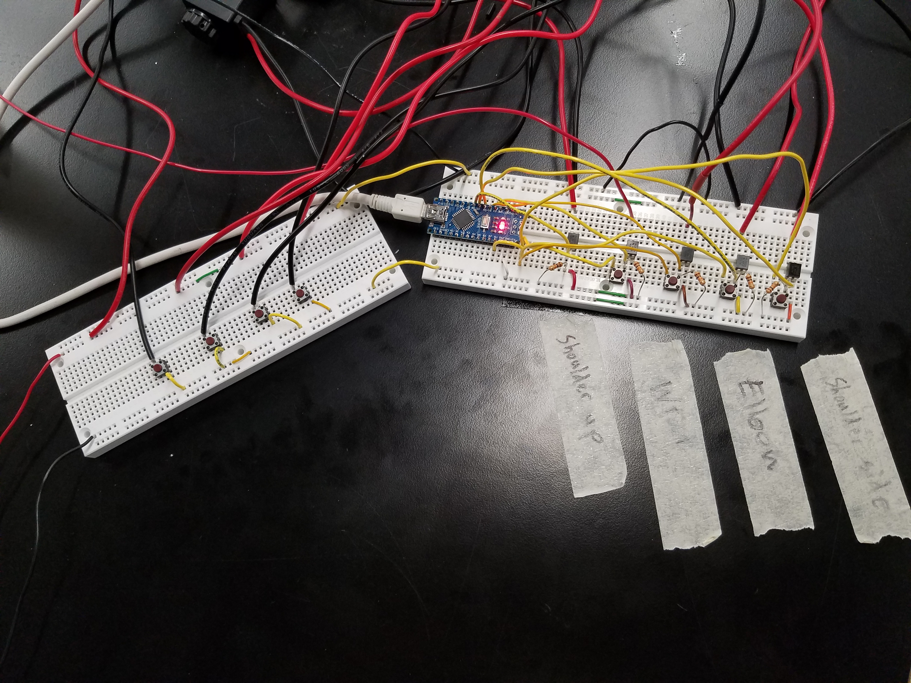

This is a webpage for Ken Michalek's work in ENSC-E123, a course offered at the Harvard University extension school.

# Digital Logic Circuit for Robot Arm

This is my final project for ENSC-E123. My goal is to create a circuit using digital logic gates to control the [robot arm](https://kem406.github.io/PHYS-S12/12/) I built for PHYS-S12.

## Original proposal

The circuit I have currently for this robot is as follows:

The black boxes in the bottom left represent the pins of an arduino nano. As you can see, this was before I knew what switch debouncing was, since the solenoids on the right are activated directly by the push of a button. This did cause problems (oftentimes it took a few presses before the solenoids actually responded), and I had no idea what was causing it until I learned about the need to switch debounce.

Here is how the circuit was set up in real life. The pushbuttons trigger MOSFET transistors which in turn activate the solenoid valves which control air flow to the robot.

One set of buttons are wired directly to the solenoids which release pressure, while the other set of buttons go to the inputs of an Arduino.

This circuit was very limited in its function. Other than activating the various valve solenoids in the robot’s joints, the only thing it does is activate a master control valve whenever I actuate any of the robot’s joints. It’s not even certain that an Arduino is necessary for this in the first place.

The circuit I want to build for the final project will do all of this and more:

* Debounce all switches properly

* Activate the master control valve whenever any of the other valves are activated without the use of an arduino (or possibly any logic gates)

* Prevent any joint in the robot from moving up and down at the same time, light a red LED and sound a warning buzzer if someone tries to do so

* Implement some kind of control feedback to prevent the air muscles (McKibben Actuators) from building up too much air pressure

I believe everything here can be accomplished entirely using logic gates, and (best of all) without anything that needs to be programmed like the Arduino.
