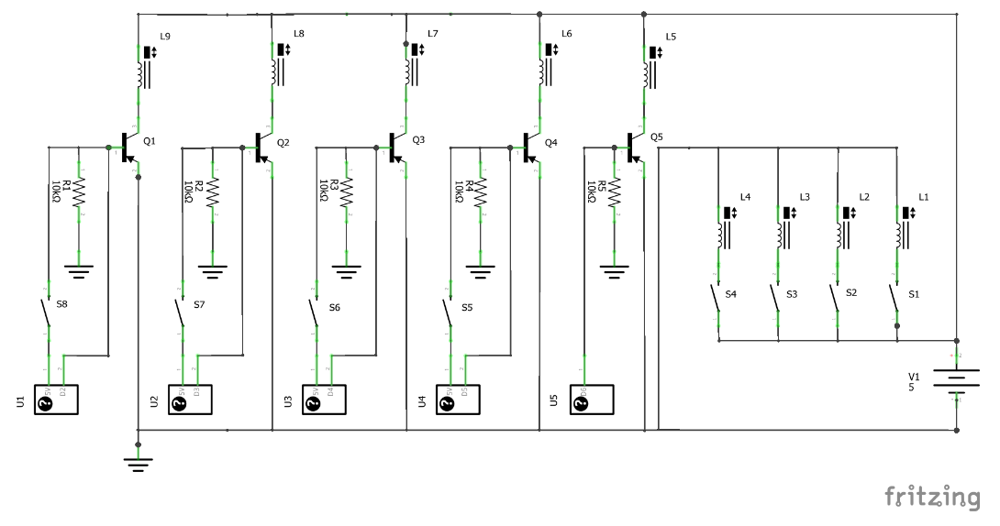
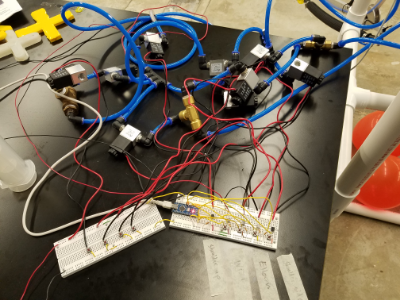
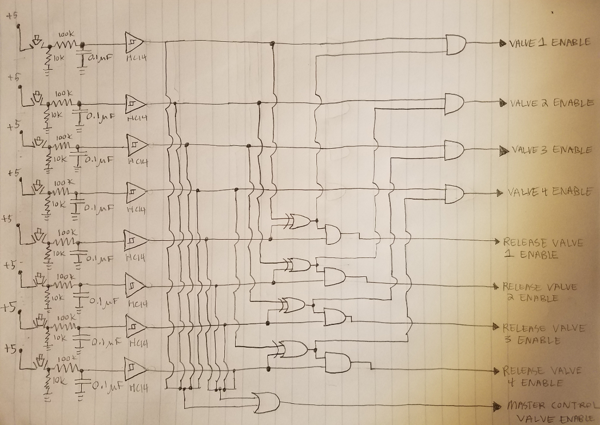
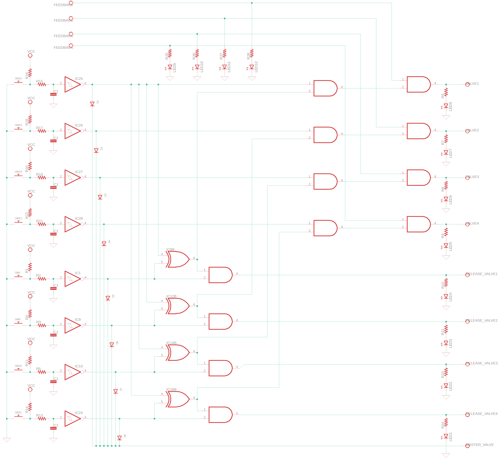

This is a webpage for Ken Michalek's work in ENSC-E123, a course offered at the Harvard University extension school.

# Digital Logic Circuit for Robot Arm

This is my final project for ENSC-E123. My goal is to create a circuit using digital logic gates to control the [robot arm](https://kem406.github.io/PHYS-S12/12/) I built for PHYS-S12.

## Original Proposal 5/1/2020

The circuit I have currently for this robot is as follows:

The black boxes in the bottom left represent the pins of an arduino nano. As you can see, this was before I knew what switch debouncing was, since the solenoids on the right are activated directly by the push of a button. This did cause problems (oftentimes it took a few presses before the solenoids actually responded), and I had no idea what was causing it until I learned about the need to switch debounce.

Here is how the circuit was set up in real life. The pushbuttons trigger MOSFET transistors which in turn activate the solenoid valves which control air flow to the robot.

One set of buttons are wired directly to the solenoids which release pressure, while the other set of buttons go to the inputs of an Arduino.

This circuit was very limited in its function. Other than activating the various valve solenoids in the robot’s joints, the only thing it does is activate a master control valve whenever I actuate any of the robot’s joints. It’s not even certain that an Arduino is necessary for this in the first place.

The circuit I want to build for the final project will do all of this and more:

* Debounce all switches properly

* Activate the master control valve whenever any of the other valves are activated without the use of an arduino (or possibly any logic gates)

* Prevent any joint in the robot from moving up and down at the same time, light a red LED ~~and sound a warning buzzer~~ if someone tries to do so

* Implement some kind of control feedback to prevent the air muscles (McKibben Actuators) from building up too much air pressure

I believe everything here can be accomplished entirely using logic gates, and (best of all) without anything that needs to be programmed like the Arduino.

## Project Update 5/8/2020

I want the new circuit to incorporate a feature that the Arduino-based circuit didn't. Namely, the ability to detect invalid commands, like an elbow moving up and down at the same time. This was something I managed to wire up for a simple valve test, but didn't implement into the final version of the robot:

<iframe src="https://www.youtube.com/embed/G4ze2Gb5cMY"
    width="560"
    height="315"
    frameborder="0"
    allowfullscreen>
</iframe>

A more intuitive demo can be seen below, where a simple elbow ceases movement when it is told to move up and down at the same time:

<iframe src="https://www.youtube.com/embed/UXNurMPjWgg"
    width="560"
    height="315"
    frameborder="0"
    allowfullscreen>
</iframe>

Just like in this demo, I would eventually like to incorporate LEDs into the new circuit (the buzzer seems unnecessary): blue for pressure in, yellow for pressure out, and red for when an invalid command is detected. I'll disregard the LEDs for now, however⁠—here is a rough schematic that incorporates switch debouncing and demonstrates a configuration of logic gates to achieve the desired effect:

Invalid commands are detected by the exclusive-OR (a.k.a. XOR) gates and will only enable valves when either one or the other for a specific joint are activated. In addition, all eight pushbuttons are wired to a cascade of OR gates (represented in the schematic by just one OR gate near the bottom) that together enable the master control valve, which lets in air flow to each of the eight valves. However, it is not yet certain to me whether these OR gates are necessary, or if the eight pushbuttons can simply be directly wired to the master control valve enable.

Goals for the final project submission:

* Learn how to create a professional-looking schematic with Eagle

* Determine the specific part needed for each logic gate and determine where to buy them

* Incorporate some pretty LEDs into the design

* Incorporate feedback control by ceasing activation of the pressure intake valves when unsafe air pressures are detected (i.e. don't let someone hold the button down to pump air into the robot for too long)

* Determine whether or not the OR gates for the master control valve are necessary

## Final Project Submission 5/15/2020

Here is the finalized design of the circuit. Several things are changed from the previous iteration, including the addition of feedback control, a [simplified OR gate](http://www.learningaboutelectronics.com/Articles/Diode-OR-gate-circuit.php) for the master valve, the adjusting of pushbuttons to active-low, and a lighting of red LEDs when feedback is detected (instead of an invalid command, because, in my opinion, feedback is much more critical).

Comprehensive list of features:

* All switches properly debounced

* Master valve opens when any of the other valves are opened

* Ceases movement if invalid command detected (intake and release valve activated at same time)

* Ceases air intake if feedback signals detected (i.e. don't let someone hold down button and pump air in indefinitely)

* For each joint, lights a blue LED for air pressure in, a yellow LED for pressure out, and a red LED for feedback detection

* Replaces the cascade of OR gates with a single diode OR gate

Parts list:

* 4X [blue LEDs](https://www.alliedelec.com/product/kingbright/wp7113qbc-d/70062986/?utm_source=google&utm_medium=cpc&adpos=&scid=scplp70062986&sc_intid=70062986&gclid=EAIaIQobChMI3LmQo6W16QIVjInICh1eLALEEAQYBCABEgKgjPD_BwE&gclsrc=aw.ds)

* 4X [yellow LEDs](https://www.parts-express.com/super-ultra-bright-yellow-5mm-led-10000-mcd--070-542)

* 4X [red LEDs](https://lighthouseleds.com/5mm-led-red-ultra-bright-15-000-mcd.html?gclid=EAIaIQobChMItKzs2KW16QIVF47ICh2K2wHYEAQYAyABEgIkhfD_BwE)

* 8X [1N4001 diodes](https://www.digikey.com/product-detail/en/on-semiconductor/1N4001/1N4001FSCT-ND/1532742)

* 2X [74HC08 ICs](https://www.digikey.com/product-detail/en/texas-instruments/SN74HC08N/296-1570-5-ND/277216)

* 1X [74HC86 IC](https://www.digikey.com/product-detail/en/texas-instruments/SN74HC86N/296-8375-5-ND/376842)

* 2X [74HC14 ICs](https://www.digikey.com/product-detail/en/nexperia-usa-inc/74HC14D-653/1727-2783-2-ND/763005)

* 8X [pushbutton switches](https://www.newark.com/alcoswitch-te-connectivity/1825910-6/tact-switch-spst-0-05a-24vdc-solder/dp/60M5365?gclid=EAIaIQobChMIp6qhkKW16QIVBeXICh0pxgEXEAQYBCABEgLOOPD_BwE&mckv=s_dc|pcrid|434136793434|plid||kword||match||slid||product|60M5365|pgrid|100464451146|ptaid|pla-904243529025|&CMP=KNC-GUSA-GEN-Shopping-NewStructure-Switches-Relays)

* 8X [10K resistors](https://www.digikey.com/product-detail/en/te-connectivity-passive-product/YR1B10KCC/A105970TB-ND/2389737)

* 8x ~[100K resistors](https://www.digikey.com/product-detail/en/yageo/MFR-25FBF52-110K/110KXBK-ND/13481)

* 8X [0.1μF capacitors](https://www.digikey.com/product-detail/en/nichicon/UMA1H0R1MCD2TP/493-10420-3-ND/4312419)

Goals for the future:

* Get better at making schematics in EAGLE

* Devise some way to measure feedback (such as applying a current between the pivot pole and the top of the shoulder so [when they contact](https://www.youtube.com/watch?v=t5dK5Kn9nus&t=10s), a signal is sent to disable the valve)

* Turn the schematic into a manufacturable PC board, possible something that can be etched on the ShopBot

* Incorporate header pins and terminals in order to connect wires from the solenoid valves

* Build a nice looking housing for the PC board and mount it on the robot
